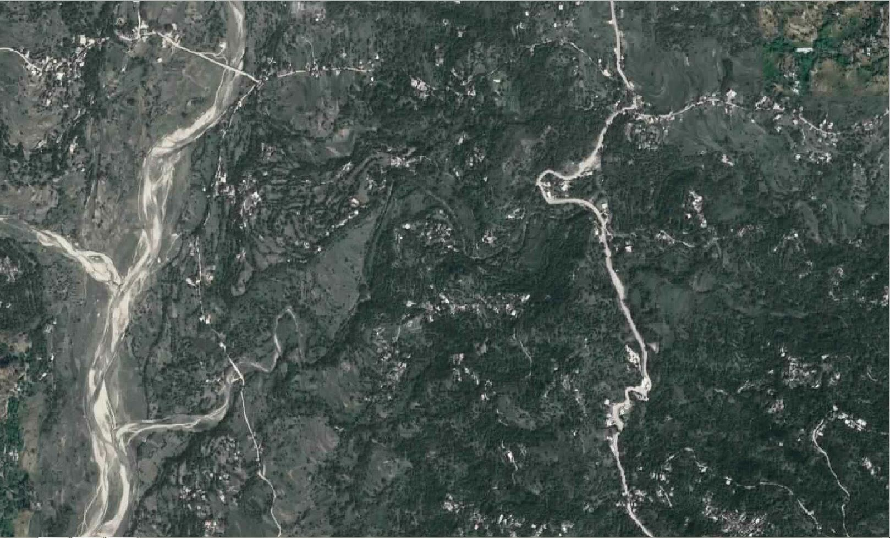
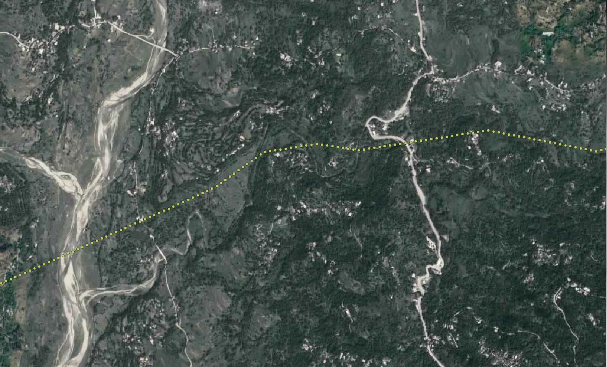

# Prediction of seismic survey path
<h2>Background:</h2>
ONGC carries out seismic survey before carrying out drilling activities in a new location.
The path used for this seismic survey is crucial since it will be used in the project’s further
activities.
My work was to predict this path based on the paths that were chosen in the previous
projects. If the model successfully predicts the paths, then it would be a huge aid to the
geophysicists working on the project.
<h2>Dataset:</h2>
Satellite images with seismic survey paths marked were used as input. They were cropped down to the dimension of 66x66 with 3 channels ie RGB. 
<h3>Input:</h3> 
<h3>Expected output:</h3>Approach:</h2>
Convolutional models and Generative Adversarial Networks(GANs) were implemented to check the prediction performance.
<h3>Convolution:</h3>
Convolutional models with different architectures were implemented.
Files: <a href="https://github.com/Varun-22/Prediction-of-seismic-survey-path/blob/master/Convolution/satimgconv.py">satimgconv.py</a>, <a href="https://github.com/Varun-22/Prediction-of-seismic-survey-path/blob/master/Convolution/SatImgConv.ipynb">SatImgConv.ipynb</a>
<h3>GAN:</h3>
Generative Adversarial network was implemented which is available in the files: <a href="https://github.com/Varun-22/Prediction-of-seismic-survey-path/blob/master/GAN/satimggan.py">satimggan.py</a>, <a href="https://github.com/Varun-22/Prediction-of-seismic-survey-path/blob/master/GAN/SatImgGAN.ipynb">SatImgGan.ipynb</a>
<h2>Results:</h2>
Convolution: The model failed to reconstruct the images even during the training. Results are available in <a href="https://github.com/Varun-22/Prediction-of-seismic-survey-path/blob/master/Convolution/SatImgConv.ipynb">SatImgGan.ipynb</a>. 
GAN: The model is able to reconstruct the images during the training but is overfitting to the training data. Therefore, the testing performance is heavily degraded. Results are available in <a href="https://github.com/Varun-22/Prediction-of-seismic-survey-path/blob/master/GAN/SatImgGAN.ipynb">SatImgGan.ipynb</a>
